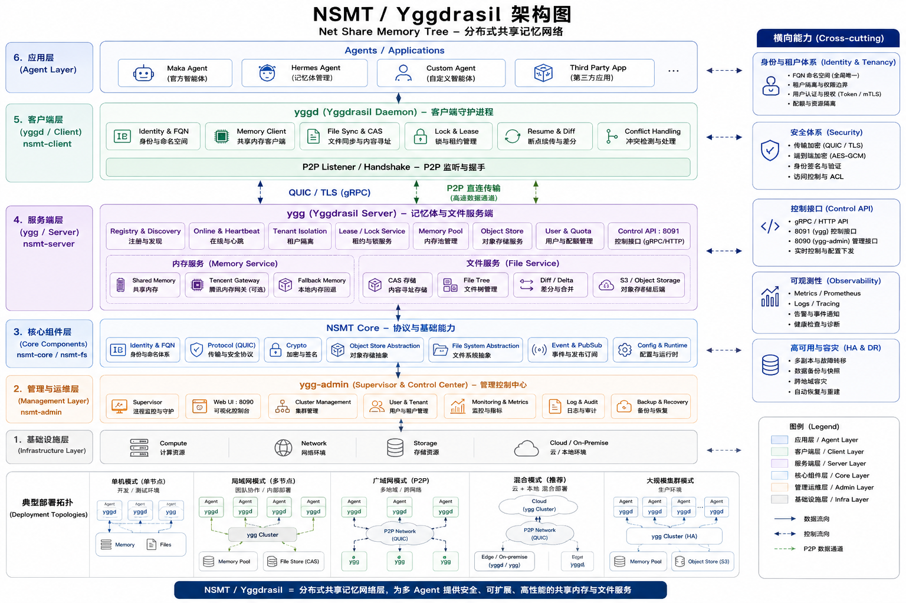

# NSMT / Yggdrasil — Net Share Memory Tree

> A multi-tenant, multi-machine, multi-agent **shared memory + shared file** network layer.
> 中文版见 [README.zh-CN.md](README.zh-CN.md)

NSMT (codename **Yggdrasil**, the Norse world-tree) lets agents (Maka / Hermes / custom) running on
different machines join one **user domain** to share one memory tree and one set of shared files —
with identity, locking, resume, P2P, encryption, quotas and a web admin console.

---

## Features

| Milestone | Feature |
|---|---|
| M0–M2 | Identity (FQN/Ed25519) · QUIC transport · online registry · memory dual-write/fallback · shared file CAS/tree/lock |
| M3–M4 | Auth hardening · conflict handling · ObjectStore abstraction · resume · S3 backend · P2P mesh · conflict CLI |
| M5 | MinIO S3 live · per-tenant quota · E2E encryption · interactive conflict merge |
| M6 | Control API (`--control :8091`) · user system (sqlx Any: SQLite/MySQL/PG + argon2) · per-user quota (free=50MB / pro=1GiB) · fixed memory (`nsmt:share_dir` note) |
| M7 | `ygg-admin` supervisor (spawn/restart/kill ygg, crash auto-restart) + Web UI (:8090) + control-API aggregation |
| M8 | Membership (`users.plan` free/pro) · quota UI (usage bar + upgrade CTA) · billing hooks reserved |
| M9 | P2P peer auth + NAT hole punch · conflict Web GUI (`conflicts-web`) · S3 tenant prefix · E2E key rotation / per-tenant keys · domain pool sharding |
| Backlog | Admin process restart · tenant backup/restore (control API) |

---

## Architecture



```
                       User Domain "ser163"
┌──────────────────────────────────────────────────────────────┐
│  Machine A (home)              Machine B (work)               │
│  ┌──────────────┐              ┌──────────────┐               │
│  │ agent (maka) │              │ agent(hermes)│               │
│  └──────┬───────┘              └──────┬───────┘               │
│  ┌──────▼────────┐            ┌──────▼────────┐               │
│  │ yggd (client) │◄──────────►│ yggd (client) │  ← Rust daemon│
│  │  ├ Tencent GW │            │  ├ Tencent GW │  ← memory    │
│  │  ├ nsmt_share │            │  ├ nsmt_share │  ← files     │
│  │  └ P2P listener            │  └ P2P listener              │
│  └──────┬────────┘            └──────┬────────┘               │
│         │       QUIC (UDP)           │  P2P direct            │
│         └──────────────┬─────────────┘                        │
│                        ▼                                     │
│              ┌─────────────────────┐                          │
│              │   ygg (relay server)│  ← Rust, single binary  │
│              │  registry / online  │                          │
│              │  locks (lease)      │                          │
│              │  object store       │  (local FS / S3/MinIO)  │
│              │  domain memory pool │  (sharded, per tenant)  │
│              │  users / quotas     │  control API :8091      │
│              └─────────────────────┘                          │
│              ┌─────────────────────┐                          │
│              │ ygg-admin :8090     │  ← supervisor + Web UI  │
│              └─────────────────────┘                          │
└──────────────────────────────────────────────────────────────┘
```

## Components

| Binary | Crate | Role | Ports |
|---|---|---|---|
| `ygg` | `nsmt-server` | relay + registry + locks + object store + memory pool + users + control API | UDP 5555, :8091 |
| `yggd` | `nsmt-client` | handshake, memory dual-write/fallback, file sync (CAS/tree/diff/lock/resume/P2P), conflict CLI + Web GUI | P2P listener, :8088 |
| `ygg-admin` | `nsmt-admin` | out-of-process supervisor + Web UI + control aggregation | :8090 |
| — | `nsmt-core` | identity, frame codec, messages, E2E crypto, peer-auth frames | — |
| — | `nsmt-memory` | Tencent Gateway HTTP client (recall/capture/search/health) | — |
| — | `nsmt-fs` | ObjectStore abstraction (Local/Memory/S3) + `PrefixedObjectStore` | — |

---

## Quick Start

### Build

```bash
cargo build --release
# target/release/nsmt-server -> ygg
# target/release/nsmt-client -> yggd
# target/release/nsmt-admin  -> ygg-admin
```

### Run

```bash
# 1) (optional) Tencent memory gateway
node --import <path>/src/gateway/server.ts &

# 2) server with control API + admin token
NSMT_ADMIN_TOKEN=secret ./target/release/nsmt-server 0.0.0.0:5555 --control 127.0.0.1:8091

# 3) (optional, M7) supervisor + Web UI
./target/release/nsmt-admin --ygg ./target/release/nsmt-server \
  --control 127.0.0.1:8091 --bind 127.0.0.1:8090 --token secret -- \
  0.0.0.0:5555 --control 127.0.0.1:8091

# 4) register the tenant once (client keys auto-generated on first run)
./target/release/nsmt-client 127.0.0.1:5555 2>/dev/null || true
ygg admin add-tenant ser163 "$(cat ~/.nsmt/domain.pub)"

# 5) client A (online) / client B (file sync, another "machine")
NSMT_USER_DOMAIN=ser163 NSMT_AGENT_TAG=maka   ./target/release/nsmt-client 127.0.0.1:5555
NSMT_USER_DOMAIN=ser163 NSMT_MACHINE_ID=bbbb1111aaaa0000 \
  NSMT_SHARE_DIR=~/nsmt_share_b ./target/release/nsmt-client 127.0.0.1:5555 fs

# 6) conflict merge Web GUI (M9.2)
./target/release/nsmt-client 127.0.0.1:5555 conflicts-web 8088   # http://127.0.0.1:8088
```

### Memory

```bash
# capture = dual-write (domain pool + local fallback); recall = network-first, timeout → local
yggd 127.0.0.1:5555 capture "user said" "assistant replied"
yggd 127.0.0.1:5555 recall "question"
```

### Conflicts

```bash
yggd 127.0.0.1:5555 conflicts                          # list
yggd 127.0.0.1:5555 merge .sync-conflict-xxx [--keep-local|--keep-remote]
yggd 127.0.0.1:5555 conflicts-web                      # Web GUI at :8088
```

---

## Documentation

| Doc | Content |
|---|---|
| `docs/项目策划.md` | Original requirements & design decisions |
| `ARCHITECTURE.md` | Architecture overview |
| `protocol/protocol.md` | **Wire protocol spec — single source of truth** |
| `DEV-ROADMAP.md` | Development roadmap M6–M9 + backlog |
| `deploy/` | Deployment guide: server / client / overview |

## Testing

```bash
cargo test        # unit + integration tests across all crates
```

## Status

All milestones **M0–M9** and the **backlog** are implemented ✅ (2026-08-30), with end-to-end
verification on macOS (dual-machine file sync + E2E, P2P peer fetch, admin restart, backup/restore,
membership upgrade). See `DEV-ROADMAP.md`.

## License

MIT
